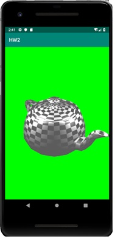
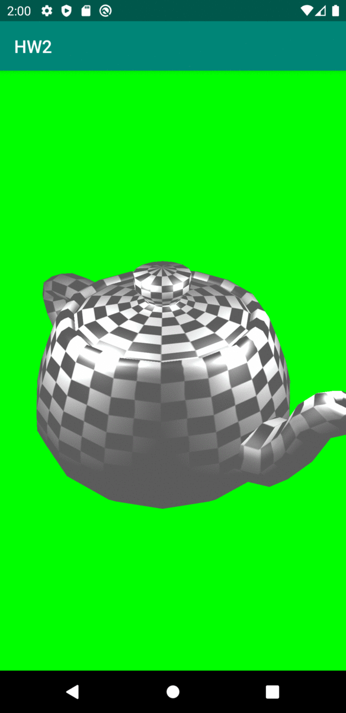
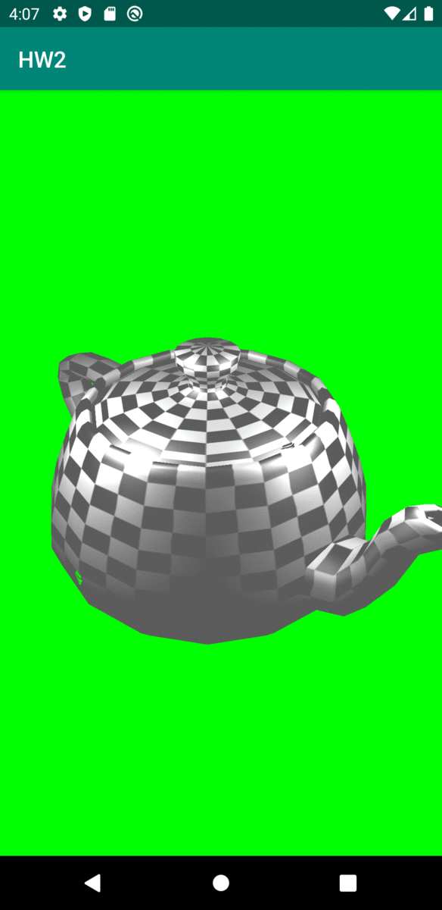

# Homework 2
The homework 2 tests your understand about rendering pipeline, texture, lighting, displacement mapping, and alpha blending.  

* [Procedure](#procedure)
* [Result](#result)
* [Deadline](#deadline)
* [Note](#note)

## Procedure
1. Download the files in this repository and unzip the OpenGLES_HW2.zip. 
   - (Password is required. Please check the klas information.)
2. Follow the instructions provided by GG_HW2_guide.pdf
3. Invest your time to achieve the goal!

## Result
Problem 1 result:  

Problem 2 result:  

Problem 3 result:  

Problem 4 result:  

## Deadline
* If spring class: 5.22. 23:50

## Note
* TA: songhs@khu.ac.kr (송현수)
* Please send your questions to TA first. 
* OpenGLES uses column major order. 
* Prepare for a boss homework^^. 
* Thank you for your star.
